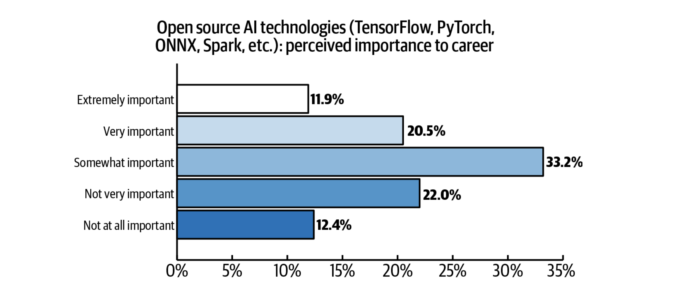

# Artificial Intelligence

## What is Artificial Intelligence

AI needs data.

## Key open source projects

* PyTorch
* Tensorflow
* ONNX
* Spark
* Keras

## Why does AI matter in an open source cloud?

## Cloud comparison (as tabs)

=== "IBM Cloud"

    * Watson Studio

=== "GCP"

    * MySQL

=== "AWS"

    * RDB

=== "Azure"

    * SQL
