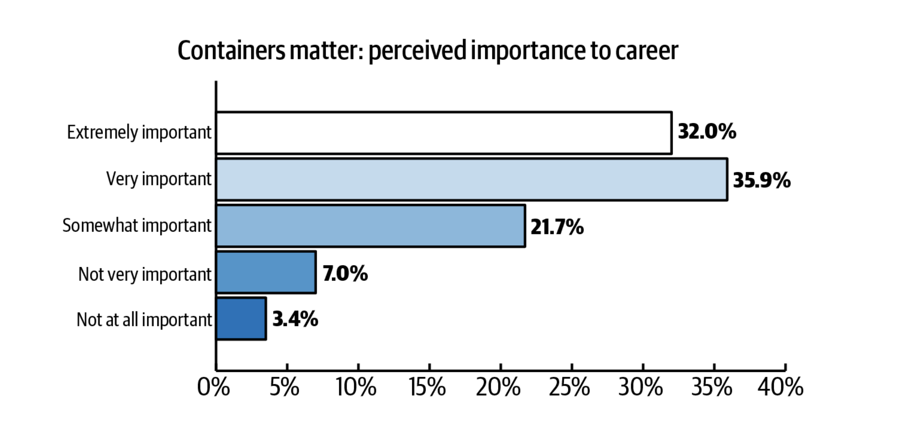
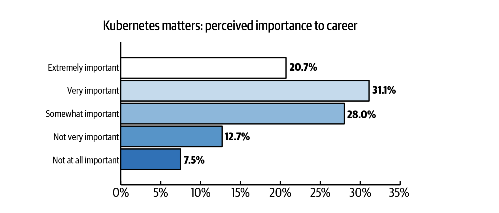

# Containers

## What are containers

Containers are run in Kubernetes.

## Key open source projects

* Kubernetes
* Quay
* Docker

## Why do containers matter in an open source cloud?

## Cloud comparison (as tabs)

=== "IBM Cloud"

    * IKS
    * ICR

=== "GCP"

    * GKE
    * GCR

=== "AWS"

    * EKS
    * ACR

=== "Azure"

    * AKS
    * ACR

## Cloud comparision (as a table)

Or maybe this is better as a table

| IBM Cloud | GCP | AWS | Azure |
| - | - | - | - |
| IKS | GKE | EKS | AKS |

## References

* [Kubernetes](https://kubernetes.io)
